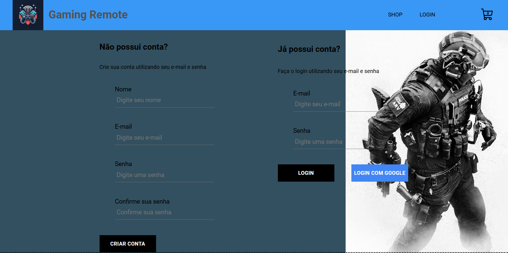

# Gaming Remote

 Projeto elaborado na aulas de React JS da Coderhouse, com algumas tecnologias como React, Vite e Firebase. **Gaming Remote** é um e-commerce gaming, com página de registro, login, sessões com os itens a venda e carrinho de compras, informando detalhes como quantidade dos itens, subtotal e total da compra.
 
 O uso do React traz consigo dinamismo, performance e uma ótima usabilidade para o usuário, Neste projeto foi utilizado o uso de contexto, trazendo facilidades e praticidades em seu uso.

 O Firebase tem a função de auxiliar nossa aplicação com o autenticador de login e banco de dados, fornecendo toda a estrutura nos bastidores.
 
## 🛠 Habilidades Utilizadas

 * React + Vite
 * Firebase
 * Git / Github
 * Vercel

## Referências

 - [MDN](https://developer.mozilla.org/pt-BR/)
 - [Readme.so](https://readme.so/pt)
 - Aulas de React JS pela [Coderhouse](https://www.coderhouse.com/)

## 🚀 Sobre mim
 Sou estudante em: 
  - Desenvolvimento Fullstack pela [Coderhouse](https://www.coderhouse.com/);
  - Engenharia de Software pela [Estácio](https://estacio.br/).
Meu contato no [LinkedIn](https://www.linkedin.com/in/leonardoformaggio/).
## Documentação

 Para saber mais sobre o uso do **React** e **Firebase** acesse:

 * [React](https://react.dev/)

 * [Firebase](https://firebase.google.com/?hl=pt-br)

 ## Imagens da Aplicação

 ### Tela Home
 

 ### Tela de Login
 
